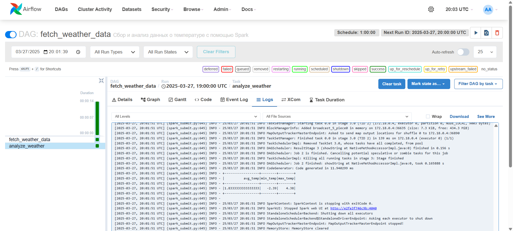
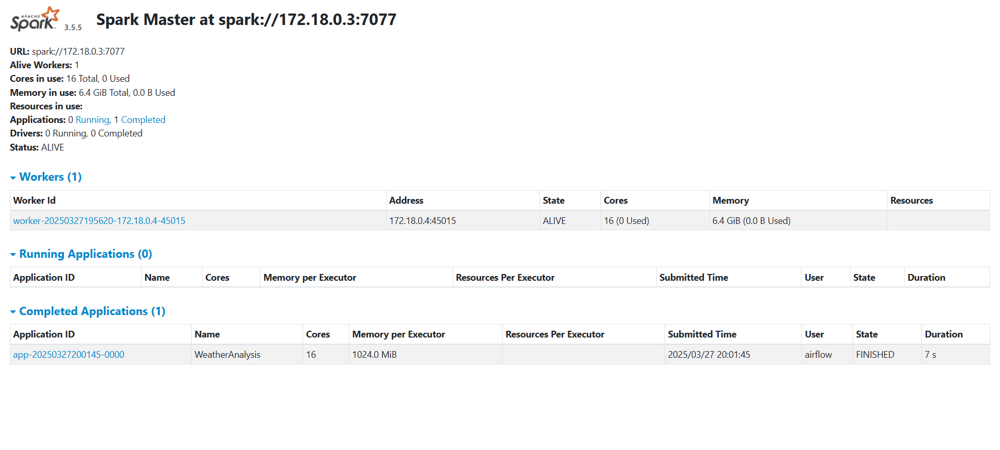

# datatools - Airflow DAG для сбора и анализа данных о погоде

## Как запустить проект

Убедитесь, что у вас установлен и запущен Docker Engine, затем выполните команду:

```sh
docker compose up --build -d
```

Чтобы остановить контейнеры, используйте:

```sh
docker compose down
```

## Доступ к Airflow

- Веб-интерфейс: [http://localhost:8080](http://localhost:8080)
- Логин: `airflow`
- Пароль: `airflow`

## ЛР 1: Сбор данных о температуре с OpenWeather API

DAG `fetch_weather_data` автоматически собирает данные о средней температуре в
нескольких крупных городах с использованием OpenWeather API.  
Запуск происходит **каждый час**.

### **Настройка API-ключа**

Перед запуском добавьте API-ключ в файл `.env` в корне проекта:

```sh
OPENWEATHER_API_KEY=<YOUR_OPENWEATHER_API_KEY>
```

## ЛР 2: Анализ температуры с Apache Spark

Вторая лабораторная работа добавляет анализ температуры с использованием **Apache Spark**.

### **Как работает DAG `fetch_weather_data`**

DAG выполняет два этапа:

1. **Сбор данных**  
   - Airflow получает данные о температуре городов через API OpenWeather.  
   - Результаты сохраняются в CSV-файл `/opt/airflow/spark/weather_data.csv`.  
2. **Анализ температуры в Spark**  
   - DAG запускает Spark-задачу `analyze_weather.py`.  
   - Рассчитываются метрики:
     - **Средняя температура**  
     - **Минимальная температура**  
     - **Максимальная температура**  
   - Результаты выводятся в консоль Spark.

### **Как проверить работу Spark**

После выполнения DAG можно открыть интерфейс Spark:

- **Spark UI:** [http://localhost:4040](http://localhost:4040)

---

### **Скриншоты выполнения**

- **Airflow: задача `fetch_weather_data`**  
  

- **Spark: выполнение `analyze_weather.py`**  
  
